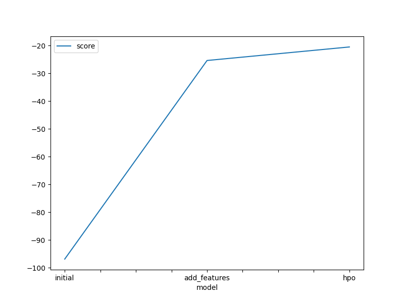
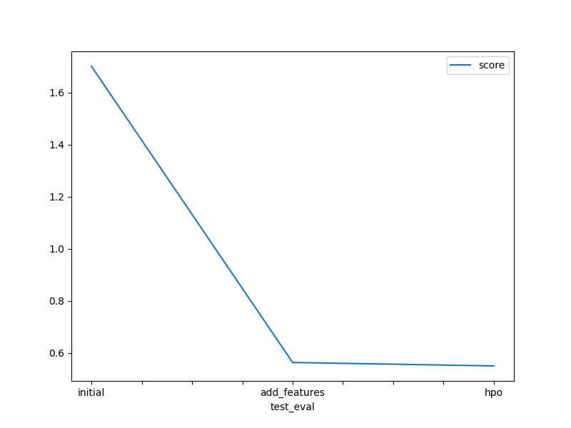

# Report: Predict Bike Sharing Demand with AutoGluon Solution
#### DIEGO CANALES DURON

## Initial Training

##### What did you realize when you tried to submit your predictions? What changes were needed to the output of the predictor to submit your results?
Needed to verify non negative values, and adjust any negative value to zero.

### What was the top ranked model that performed?
It was the hyperparameter optimization model.
## Exploratory data analysis and feature creation
### What did the exploratory analysis find and how did you add additional features?
Datetime its not a numeric feature and it has a different behavior in comparison to other features. As such, I split this feature into three categories hour, month and day to update the behavior of the variable.

### How much better did your model preform after adding additional features and why do you think that is?
The model went from 1.7 to 0.56 an improvement of -1.14 units
## Hyper parameter tuning
### How much better did your model preform after trying different hyper parameters?
Models performed similarly there was a light improvement of -0.0142, going from 0.5638 (non-tuned-model) to 0.5496 (tuned-model).
### If you were given more time with this dataset, where do you think you would spend more time?
Preprocessing the data, change scale of features and model time to normalized features.

### Create a table with the models you ran, the hyperparameters modified, and the kaggle score.
|model|hpo1|hpo2|hpo3|score|
|--|--|--|--|--|
|initial|default|default|default|1.756|
|add_features|default|default|defualt|0.5638|
|hpo|'GBM': {'num_boost_round': 1000, 'learning_rate': space.Real(0.01, 1, log=True)}|'XGB': {'n_estimators': 1000, 'learning_rate': space.Real(0.01, 1, log=True)}, |'scheduler': 'local', 'searcher':'auto',|0.5497|

### Create a line plot showing the top model score for the three (or more) training runs during the project.

TODO: Replace the image below with your own.

### Create a line plot showing the top kaggle score for the three (or more) prediction submissions during the project.

TODO: Replace the image below with your own.

